# 📱 SIM ABSENSI — Sistem Informasi Presensi Terpadu

<div align="center">


<p align="center">
  <b>Aplikasi Presensi Karyawan & Civitas Berbasis Mobile dengan Geofencing GPS, Validasi Radius Real-time, Device Binding Hardware Lock, dan Manajemen Izin Terpadu.</b>
</p>

*(Implementasi studi kasus: Institut Agama Islam Miftahul Ulum / IAIMU Tanjungpinang)*

</div>

---

## 📌 Sekilas Aplikasi

**SIM ABSENSI** adalah aplikasi mobile enterprise untuk pengelolaan kehadiran, jadwal kerja, dan perizinan civitas akademika atau karyawan secara akurat, transparan, dan anti-fraud. 

Dilengkapi dengan proteksi **1 Akun 1 Perangkat (Device ID Binding)**, teknologi **Geofencing GPS** berbasis peta OpenStreetMap dengan tile caching, validasi radius presensi, serta deteksi **Mock Location (Fake GPS)** untuk memastikan absensi dilakukan langsung di lokasi kerja yang ditentukan.

---

## ✨ Fitur-Fitur Utama

### 1. 🛡️ Keamanan & Device Binding (Hardware Lock)
- **1 User = 1 Perangkat**: Setiap akun terikat pada Unique Device Identifier (UDID) smartphone. Percobaan login di perangkat lain otomatis dicegah untuk menghindari titip akun/absen.
- **Deteksi Fake GPS / Mock Location**: Sistem memvalidasi koordinat asli GPS dan menolak upaya pemalsuan lokasi melalui aplikasi mock GPS.
- **Autentikasi Token Aman**: Menggunakan JSON Web Token (JWT) yang disimpan di secure storage lokal.

### 2. 📍 Presensi Berbasis Geofencing & Peta Interaktif
- **Peta Interaktif OpenStreetMap (OSM)**: Menggunakan engine `flutter_map` dengan cache tile offline (`flutter_map_tile_caching`) untuk loading super cepat dan hemat kuota internet.
- **Validasi Radius & Geofence Otomatis**: Mendeteksi lokasi presensi terdekat (contoh: Aula Utama / Gedung Rektorat). Jika jarak di luar radius izin, tombol presensi terkunci dan memunculkan peringatan jarak secara instan.
- **Logging Waktu Akurat**: Mencatat jam masuk dan jam pulang secara real-time ke server.

### 3. 📝 Pengajuan Izin & Cuti Digital (E-Leave)
- **Kalender Pemilih Rentang Tanggal**: Memilih periode izin/cuti dengan mudah menggunakan multi-date range picker kalender.
- **Lampiran Berkas Digital**: Mendukung unggah dokumen bukti (surat keterangan dokter, surat dinas, dll.) dalam format PDF, JPG, maupun PNG.
- **Tracking Status Pengajuan**: Mengetahui status verifikasi permohonan izin secara transparan.

### 4. 📅 Jadwal Kerja & Shift Dinamis (Schedule)
- **Kalender Interaktif**: Visualisasi agenda kerja dan shift bulanan atau harian.
- **Rincian Lokasi Tugas**: Keterangan lengkap mengenai lokasi unit tugas (misal: Ruang Helpdesk, Gedung Rektorat Lt. 1) serta jam operasional.

### 5. 📊 Riwayat & Statistik Kehadiran
- **Log Riwayat Komprehensif**: Daftar riwayat kehadiran harian lengkap dengan status hadir, tanggal, jam masuk, jam pulang, serta lokasi kampus.
- **Filter Rentang Waktu**: Kemudahan memfilter data riwayat berdasarkan tanggal tertentu.
- **Ringkasan Kartu Statistik**: Kartu ringkasan total kehadiran, izin, dan catatan presensi.

### 6. 📢 Portal Informasi & Event Kampus
- **Daftar Kegiatan & Seminar**: Feed acara resmi institusi atau agenda pelatihan.
- **Detail Agenda**: Menampilkan jadwal waktu, tempat pelaksanaan, dan deskripsi detail kegiatan.

### 7. 👤 Pengaturan Profil & Kata Sandi
- **Manajemen Biodata**: Akses cepat ke data identitas karyawan/staf (NIM/NIP, email, nomor telepon/WhatsApp, dan alamat).
- **Ubah Password**: Fasilitas pembaruan kata sandi mandiri dengan validasi keamanan minimal 8 karakter.

---

## 📸 Tangkapan Layar Aplikasi (Screenshots)

### 🔐 Autentikasi & Proteksi Perangkat
| Splash Screen | Login Pengguna | Device Binding Lock (Anti Multi-Device) |
| :---: | :---: | :---: |
| 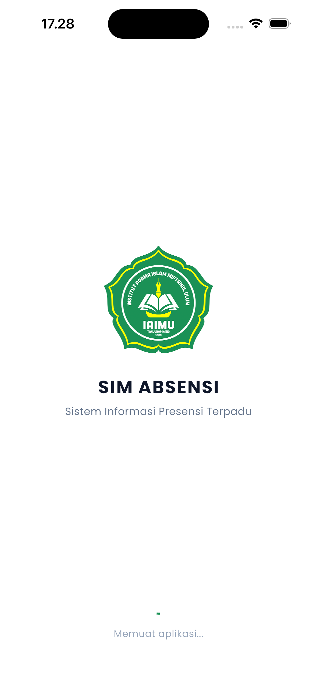 | 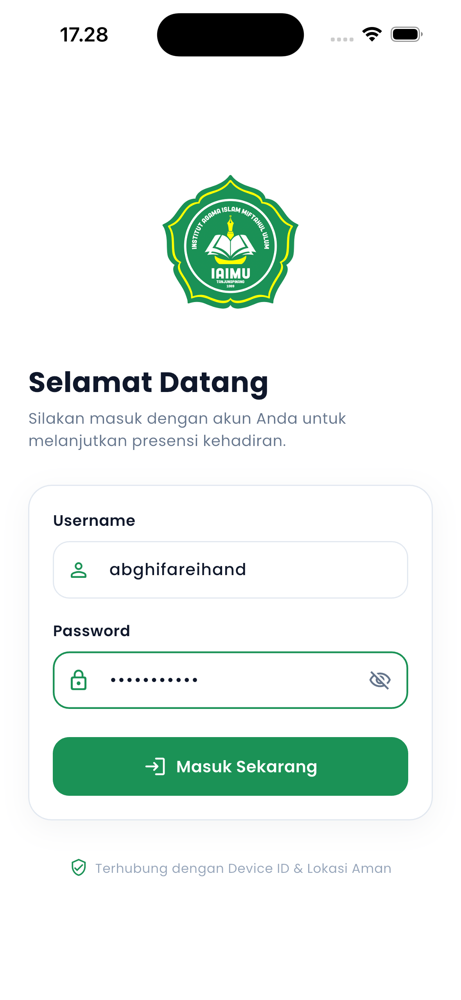 | 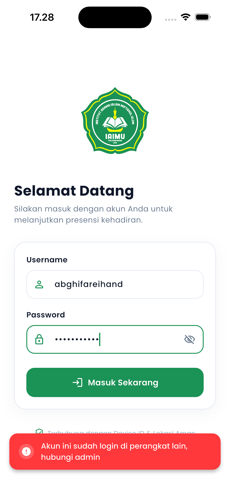 |
| *Identitas institusi & inisialisasi* | *Form login credential & UDID* | *Pencegahan multi-login di HP lain* |

---

### 📍 Dashboard Beranda & Geofencing Presensi
| Dashboard Beranda | Peta Presensi Terdekat | Validasi Radius Geofencing |
| :---: | :---: | :---: |
| 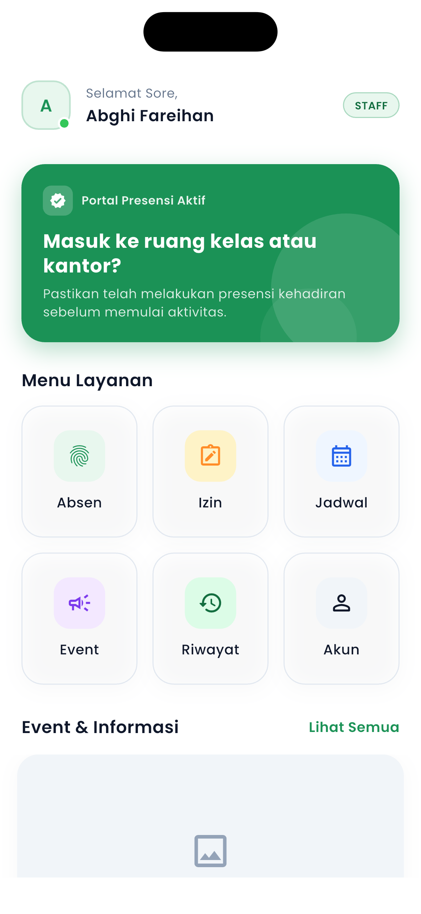 | 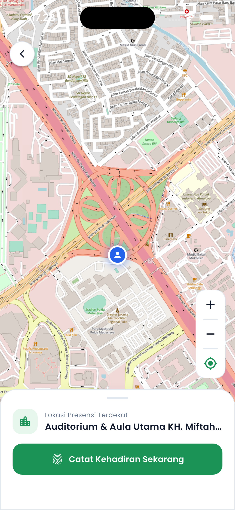 |  |
| *Menu layanan & portal presensi* | *Deteksi titik terdekat via GPS* | *Peringatan jika di luar jangkauan radius* |

---

### 📝 Pengajuan Izin & Kalender Jadwal Tugas
| Form Pengajuan Izin | Pemilih Rentang Tanggal | Jadwal Presensi & Agenda |
| :---: | :---: | :---: |
| 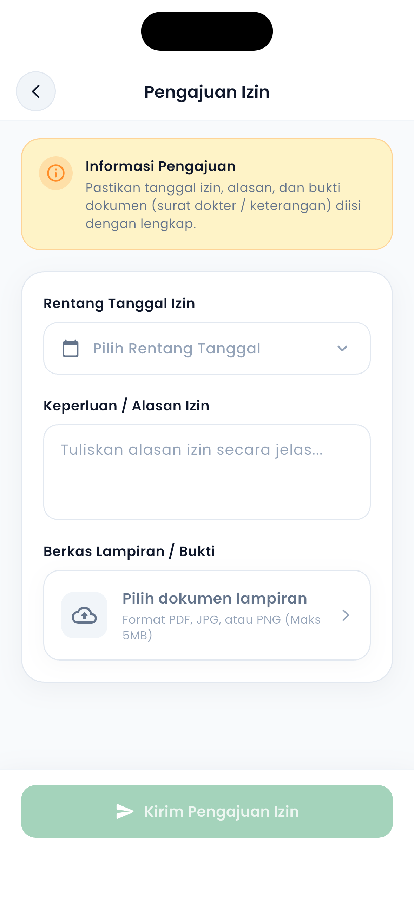 | 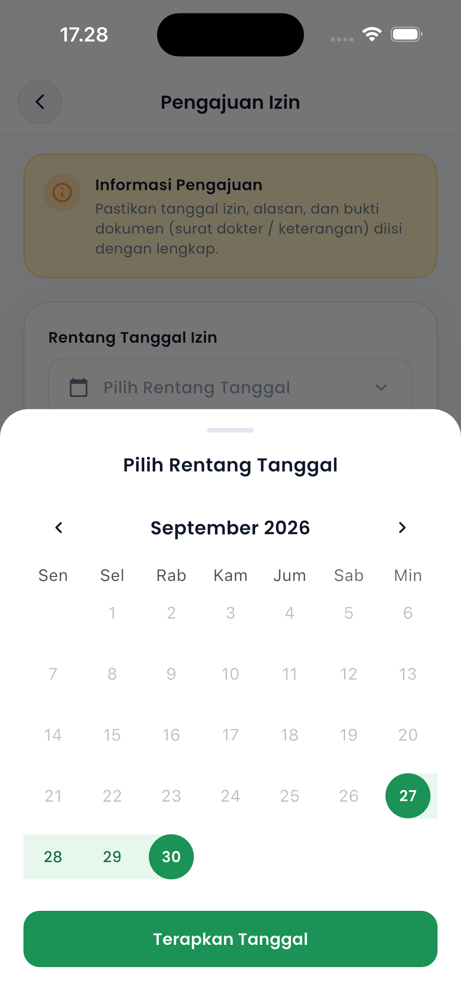 | 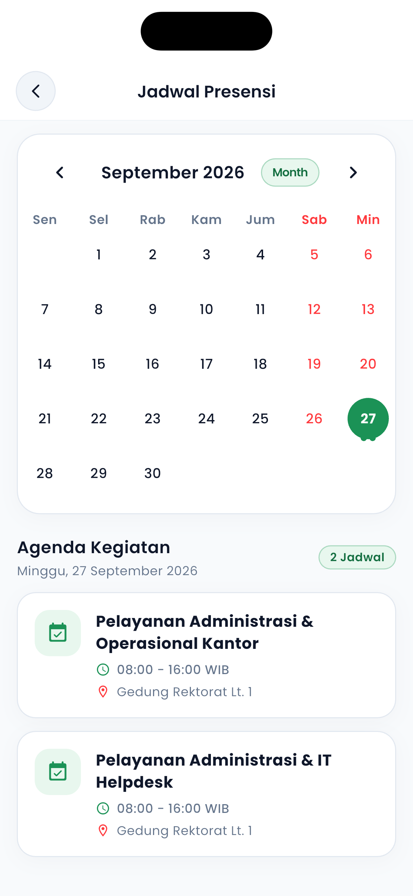 |
| *Input alasan & unggah berkas* | *Multi-date range calendar picker* | *Kalender jadwal shift & operasional* |

---

### 📊 Riwayat Kehadiran & Portal Event
| Riwayat & Statistik | Daftar Event Kampus | Detail Informasi Event |
| :---: | :---: | :---: |
| 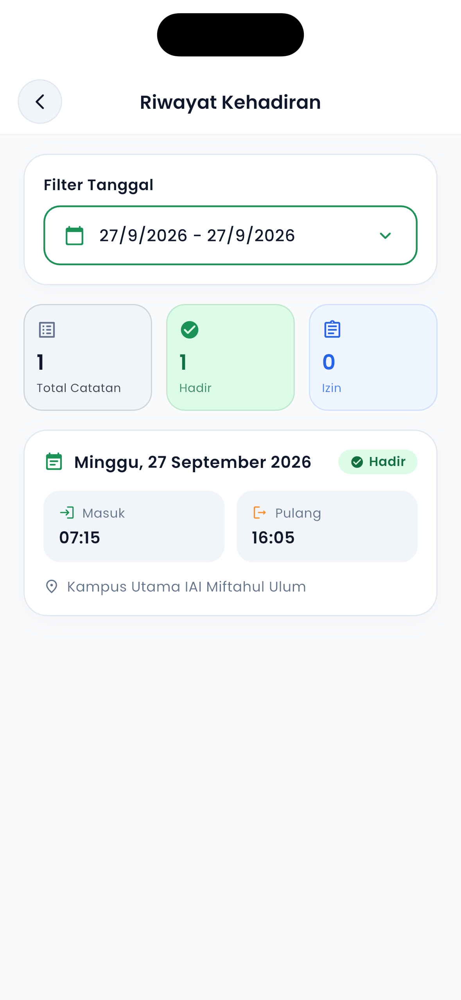 | 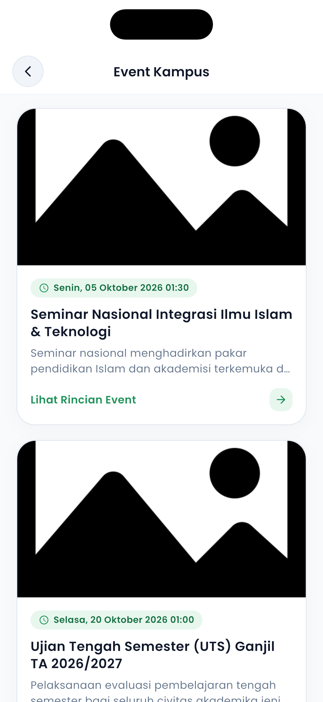 | 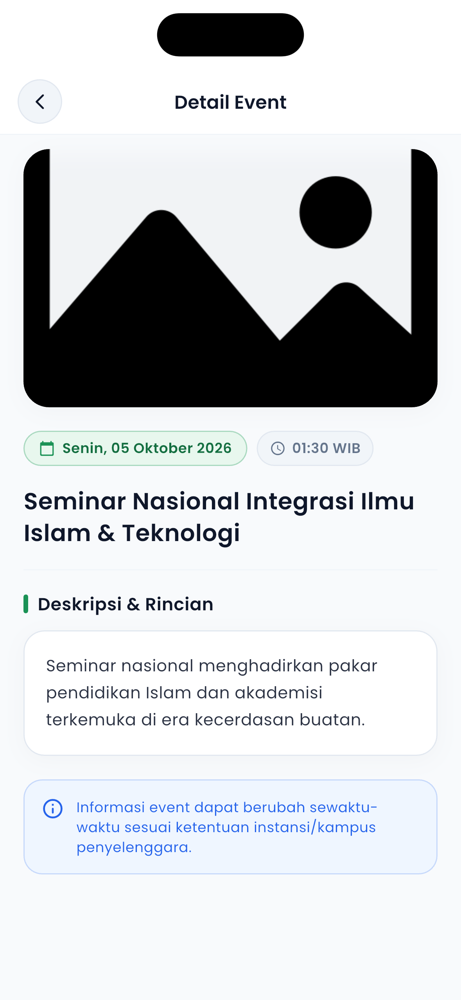 |
| *Log jam masuk/pulang & filter tanggal* | *Katalog agenda & seminar kampus* | *Rincian waktu, deskripsi, & info agenda* |

---

### 👤 Profil Pengguna & Keamanan
| Akun Pengguna | Ubah Data Profil | Ganti Kata Sandi |
| :---: | :---: | :---: |
| 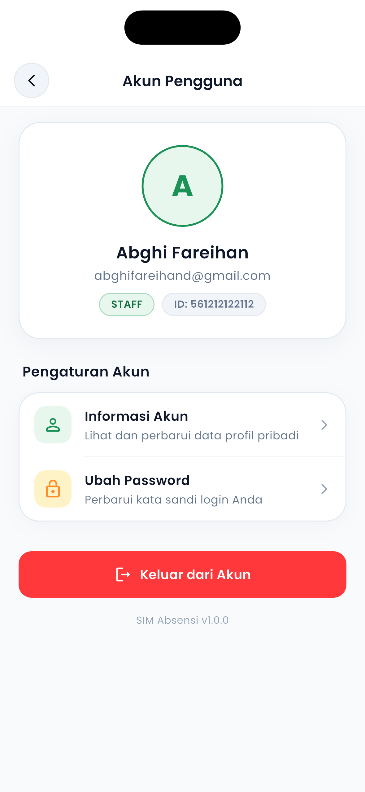 | 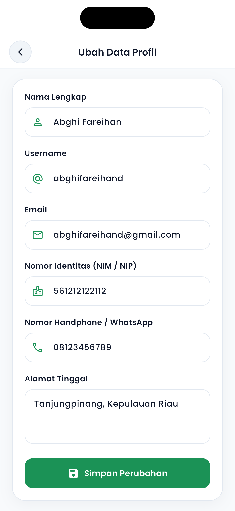 | 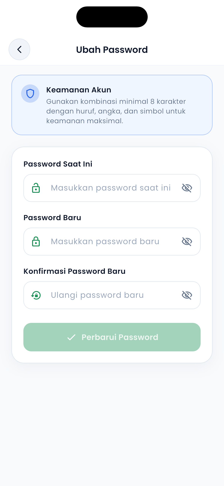 |
| *Ringkasan akun & role staf* | *Perbarui nomor kontak & alamat* | *Update password akun mandiri* |

---

## 🏗️ Arsitektur & Pola Desain

Aplikasi ini dibangun menggunakan arsitektur **MVVM (Model-View-ViewModel)** dengan pemisahan tanggung jawab yang jelas:

```
lib/
├── core/                       # Inti aplikasi, konfigurasi & utilitas
│   ├── api/                    # Service Retrofit HTTP client (Auth, Attendance, Leave, etc.)
│   ├── models/                 # Data transfer objects & JSON Serialization
│   └── services/               # Shared preferences, session management, storage
├── features/                   # Modul fitur berbasis MVVM
│   ├── attendance/             # Halaman peta presensi & logika geofence (View & ViewModel)
│   ├── auth/                   # Modul autentikasi (Splash & Login)
│   ├── event/                  # Modul feed & detail event
│   ├── history/                # Modul riwayat presensi & filter log
│   ├── home/                   # Modul dashboard beranda utama
│   ├── leave/                  # Modul pengajuan izin & unggah berkas
│   ├── profile/                # Modul profil, edit data & ubah kata sandi
│   ├── schedule/               # Modul jadwal kerja & kalender operasional
│   ├── base_view.dart          # Generic widget base view wrapper
│   └── base_view_model.dart    # ViewModel state management dasar (Busy, Error, Success)
├── ui/                         # Design system, tema warna, tipografi, & custom widget
├── main.dart                   # Entry point aplikasi & inisialisasi tile caching
└── provider_setup.dart         # Konfigurasi dependency injection Provider
```

---

## 🛠️ Teknologi & Dependencies

| Kategori | Paket / Teknologi | Keterangan |
| :--- | :--- | :--- |
| **Framework** | Flutter (SDK ^3.7.2) | Cross-platform framework berbasis Dart |
| **State Management** | `provider` | State container reaktif & Dependency Injection |
| **Networking** | `retrofit`, `dio`, `pretty_dio_logger` | Type-safe REST client & interceptor logging |
| **Peta & Lokasi** | `flutter_map`, `latlong2`, `geolocator` | Visualisasi OpenStreetMap & geolokasi GPS |
| **Map Tile Caching** | `flutter_map_tile_caching` | Manajemen cache tile peta secara offline |
| **Keamanan Perangkat** | `flutter_udid` | Ekstraksi hardware ID unik perangkat |
| **Kalender** | `table_calendar`, `calendar_timeline` | Komponen kalender jadwal & rentang tanggal |
| **Manajemen Berkas** | `image_picker`, `file_picker` | Unggah bukti foto atau dokumen izin (PDF/JPG) |
| **Environment** | `flutter_dotenv` | Manajemen konfigurasi environment variable |
| **UI Components** | `shimmer`, `flutter_svg`, `cupertino_icons` | Skeleton loader, icon vector SVG & iOS style |

---

## 🚀 Panduan Memulai (Getting Started)

### 1. Prasyarat Sistem
- **Flutter SDK**: Versi `>= 3.7.2`
- **Dart SDK**: Versi `>= 3.7.2`
- **IDE**: VS Code atau Android Studio
- **Emulator / Device Fisik**: Android atau iOS (disarankan memakai perangkat fisik untuk menguji GPS dan kamera)

### 2. Kloning Repositori
```bash
git clone https://github.com/abghifareihand/absensi_app.git
cd absensi_app
```

### 3. Konfigurasi Environment (`.env`)
Salin file template `.env.example` menjadi `.env`:
```bash
cp .env.example .env
```
Sesuaikan endpoint backend API Anda di dalam file `.env`:
```env
API_URL=https://api.yourdomain.com
```

### 4. Instalasi Dependensi
```bash
flutter pub get
```

### 5. Generate Code (Retrofit & JSON Serializable)
Jalankan `build_runner` untuk mengompilasi model dan client API:
```bash
dart run build_runner build --delete-conflicting-outputs
```

### 6. Jalankan Aplikasi
```bash
# Menjalankan di perangkat/simulator aktif
flutter run

# Menjalankan spesifik di Android atau iOS
flutter run -d android
flutter run -d ios
```

---

## 🛡️ Anti-Fraud & Keamanan Presensi

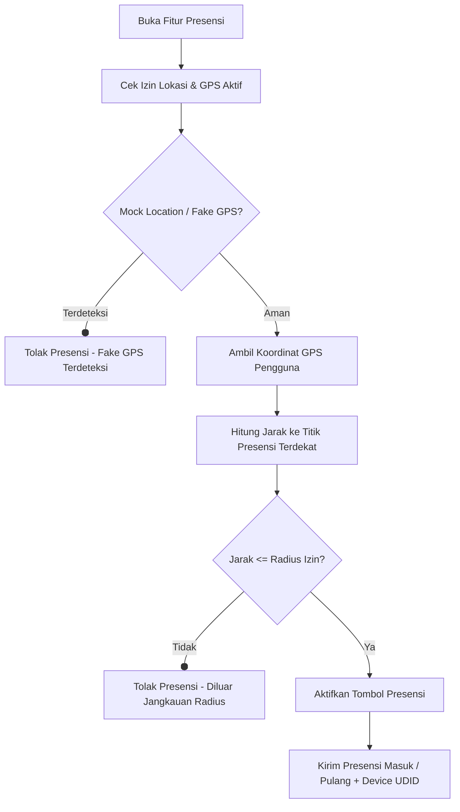

1. **Hardware Device Binding**: Setiap request login dan presensi mengirimkan `deviceId` yang telah diverifikasi pada database server.
2. **Geofencing Radius Threshold**: Jarak pengguna dihitung secara real-time terhadap titik koordinat target (latitude & longitude) menggunakan algoritma geodesi `Geolocator.distanceBetween()`.
3. **Mock Location Detection**: Mengidentifikasi status mocked location dari sistem operasi Android/iOS untuk mencegah spoofing lokasi.

---

## 📄 Lisensi

Proyek ini dikembangkan untuk kebutuhan internal civitas akademika dan berlisensi di bawah ketentuan institusi terkait.
